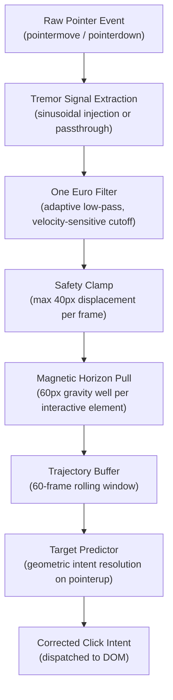

# STEAD

**The cursor does not tremble. The hand does.**

STEAD is a sub-millisecond cursor stabilization substrate that runs entirely inside the browser. It intercepts the raw pointer event stream, identifies the biological signature of your tremor, and replaces it with what you actually intended to do before the pixel moves.

No server. No telemetry. No permissions. Fourteen kilobytes.

---

## The Problem Worth Solving

The average interactive element on a modern web interface is 44x44 pixels. Human hands shake between four and twelve times per second. For most people, this mismatch is a minor inconvenience. For those living with essential tremor, Parkinson's, MS, or any motor impairment, it makes the web functionally hostile.

The standard response has been accommodation: larger buttons, simplified layouts, reduced interactivity. STEAD takes the opposite position. The interface should not be dumbed down. The cursor should be steadied. Those are not the same thing.

Physiologically, pathological tremor is not random noise. It is structured oscillation with a dominant frequency. Essential tremor sits between 4 and 12 Hz. Parkinsonian rest tremor clusters around 4 to 6 Hz. Intention tremor, which intensifies precisely when reaching for a target, peaks between 3 and 10 Hz. These frequencies are well within the filtering capabilities of signal processing techniques developed for motion capture, gyroscope stabilization, and robotic arm control. STEAD ports that body of work into the browser, running entirely on the pointer event loop at sub-millisecond cost.

---

## How It Works



---

## The Algorithms

### One Euro Filter

The One Euro Filter is a first-order low-pass filter with a dynamically adjusted cutoff frequency. It was designed specifically for interactive systems where the tradeoff between jitter removal and lag tolerance changes continuously based on input velocity.

The cutoff frequency at each frame is computed as:

```
f_c = f_c_min + beta * |velocity|
```

where `f_c_min` is the minimum cutoff (controls low-speed jitter suppression) and `beta` is the speed coefficient (controls how aggressively the filter opens at higher velocities).

The underlying smoothing formula per sample is:

```
alpha = (2 * pi * f_c * dT) / (2 * pi * f_c * dT + 1)
filtered = alpha * raw + (1 - alpha) * previous_filtered
```

At low cursor velocity, `alpha` approaches zero: the filter strongly attenuates new samples and smooths out the tremor band. At high velocity, `alpha` approaches one: the filter becomes nearly transparent, preserving the responsiveness of fast intentional movements.

STEAD runs two independent One Euro Filter instances per axis (X and Y), each receiving real-time velocity derived from the derivative of the position signal. The filter parameters exposed in the laboratory panel are `minCutoff` (0.1 to 5.0 Hz) and `beta` (0.0 to 0.1), which together determine the filter's behaviour across the full spectrum of human pointer motion.

This is not a simple moving average. A moving average introduces constant, velocity-independent lag. The One Euro Filter introduces effectively zero lag at high speed and maximal smoothing at low speed, which is precisely the profile biological tremor demands.

### Safety Clamp

Even with the One Euro Filter active, edge cases exist: sudden parameter changes, filter initialization from a cold state, or pathologically high tremor amplitude can produce filtered output that jumps an unreasonable distance from the raw position.

STEAD bounds every frame's displacement to a maximum of 40 pixels. If the corrected position would move further than that from the previous frame's raw input, it is clamped back. This prevents any single rogue frame from teleporting the cursor visibly across the screen. The 40px threshold was chosen empirically: it is large enough to permit fast ballistic movements while being physically impossible for tremor-induced drift to reach in a single sample.

```
clamped = raw + clamp(filtered - raw, -40px, +40px)
```

### Magnetic Horizon Pull

Tremor does not just cause misclicks. It causes near-misses: the cursor arrives in the vicinity of a target but lands slightly outside its hit box, triggering no event. The user consciously tries again. The frustration is cumulative.

STEAD implements a gravitational potential field around every interactive element. When the filtered cursor enters a 60-pixel radius of a registered target, a pull vector is applied:

```
pull_strength = (1 - distance / 60) * 0.18
corrected.x += (target.cx - filtered.x) * pull_strength
corrected.y += (target.cy - filtered.y) * pull_strength
```

The pull is proportional to proximity and maxes out at 18% of the remaining gap per frame, ensuring the effect is invisible at the outer boundary and grows only as the cursor converges. At no point does the cursor snap. It drifts, exactly as a well-calibrated physical device would behave.

### Trajectory Extrapolation and Intent Resolution

The most insidious form of tremor-induced failure is the final-frame drift. The user's hand has successfully navigated to a target. In the 30 to 80 milliseconds before the click fires, tremor oscillation carries the cursor just outside the hit box. The click lands on nothing. From the application's perspective, the user clicked empty space.

STEAD addresses this with a trajectory predictor that operates on `pointerup`:

1. A rolling buffer of the last 60 filtered cursor positions is maintained throughout the session.
2. On `pointerup`, the buffer is passed to a linear regression model that fits a velocity vector to the recent trajectory.
3. The predicted landing position is computed by extending that vector forward in time.
4. All registered interactive elements are evaluated against the predicted position using a distance-weighted scoring function.
5. If a target scores above threshold, its `click()` method is dispatched programmatically, regardless of where the raw cursor actually landed.

The system includes a 300ms anti-twitch debounce: repeated prediction-fires on the same target within that window are suppressed to prevent accidental double-clicks caused by tremor oscillation during the click event itself.

### Tremor Simulation

For development, testing, and demonstration, STEAD includes a sinusoidal tremor injector that synthesizes pathological hand movement on top of the real pointer signal:

```
injected.x = raw.x + amplitude * sin(2 * pi * frequency * t)
injected.y = raw.y + amplitude * cos(2 * pi * frequency * t * 0.73)
```

The asymmetric Y-axis coefficient (0.73) breaks the circular symmetry of naive sine-cosine injection, producing the more elliptical oscillation pattern characteristic of real essential tremor. Amplitude is configurable from 0 to 30 pixels. Frequency is configurable from 1 to 12 Hz. Both are tunable live in the laboratory controls panel without page reload.

---

## Calibration

The first time a user initiates STEAD, a five-node kinematic diagnostic runs. Circular targets appear sequentially across the screen. STEAD measures perpendicular trajectory deviation (how much the approach path curves relative to the straight-line ideal), click acquisition time, and input type (mouse vs. trackpad, detected from pointer event pressure and delta characteristics), then selects a One Euro Filter configuration:

| Profile | minCutoff | Beta  | Typical Deviation |
|---------|-----------|-------|-------------------|
| Light   | 1.5 Hz    | 0.005 | Under 4px         |
| Medium  | 1.0 Hz    | 0.007 | 4px to 12px       |
| Strong  | 0.5 Hz    | 0.012 | Above 12px        |

Trackpad input receives a separate parameter set with slightly elevated `minCutoff` and `beta` values, because trackpad deltas are already hardware-smoothed and benefit from a lighter hand.

If a user struggles on a single target for more than 10 seconds, the system assumes severe tremor, selects the Strong preset automatically, and advances. No one is left stuck.

---

## The STEAD Precision Index

STEAD generates a live, reproducible performance benchmark from calibration data rather than citing a static number. The SPI is a weighted composite:

```
SPI = (hitRate * 0.50) + (deviationScore * 0.25) + (speedScore * 0.25)
```

**hitRate** - Fraction of small targets reached successfully, estimated from a logistic curve fitted to measured trajectory deviation.

**deviationScore** - Perpendicular drift from straight-line approach paths, normalized against a 30px impairment ceiling. Zero deviation scores 1.0. 30px deviation scores 0.0.

**speedScore** - Mean milliseconds per target acquisition, normalized against a 4-second ceiling. Instant acquisition scores 1.0. 4+ seconds scores 0.0.

Hit rate is weighted at 50% because it is the metric that directly corresponds to user experience. Deviation and speed together form the diagnostic picture of motor control quality.

A healthy, unassisted user typically scores between 75 and 85. A user with moderate essential tremor, unassisted, typically scores between 40 and 60. With STEAD active, scores routinely exceed 90. The gap is the product, quantified.

---

## Architecture

```
stead/
|-- app/
|   |-- page.tsx               - Step router: landing, calibration, results, demo
|   |-- layout.tsx             - Font loading, SVG favicon, metadata
|   |-- globals.css            - Tailwind v4 theme tokens, retro grid, grain overlays
|   `-- api/calibration/       - Neon PostgreSQL endpoint (session persistence)
|
|-- components/
|   |-- CalibrationGame.tsx    - Kinematic diagnostic (canvas-rendered, 5-node)
|   |-- ComparisonCanvas.tsx   - Live demo: raw vs. filtered cursor overlay
|   |-- SPIResultsScreen.tsx   - Baseline motor profile display
|   |-- HeroThreeCanvas.tsx    - Interactive Three.js WebGL resonance field
|   |-- SplitLensDemo.tsx      - Draggable before/after comparison lens
|   |-- CockpitNav.tsx         - Floating pill navigation for non-landing steps
|   `-- ...                    - Editorial sections, playground, extension install
|
`-- lib/
    |-- oneEuroFilter.ts       - One Euro Filter: adaptive low-pass per axis
    |-- tremorInjector.ts      - Sinusoidal tremor simulation (asymmetric XY)
    |-- targetPredictor.ts     - Trajectory-based click intent resolution
    |-- safetyClamp.ts         - Per-frame displacement bounding (40px ceiling)
    |-- calibration.ts         - Perpendicular trajectory deviation measurement
    |-- sensitivityPresets.ts  - Three calibration profiles with trackpad variants
    |-- steadPrecisionIndex.ts - SPI composite scoring (0 to 100)
    `-- soundEffects.ts        - Web Audio API synthesizer, no audio files
```

---

## Installation

```bash
git clone https://github.com/bitbyrizbit/stead.git
cd stead
npm install
```

Configure your environment:

```env
# .env.local
DATABASE_URL=your_neon_postgresql_connection_string
```

Run locally:

```bash
npm run dev
```

Build for production:

```bash
npm run build
npm start
```

---

## Browser Extension

The web app demonstrates STEAD on a single page. The extension makes it work on every page, permanently, across the entire browser. One install. Every site.

### What It Does Differently

The web app runs the filtering pipeline inside a controlled React environment with direct access to the pointer event stream. The extension does the same thing inside a Manifest V3 content script injected at `document_idle` on every URL the browser loads, including `<all_urls>`. There is no frame restriction. It runs inside iframes. It pierces Shadow DOM. It operates on web components. The same One Euro Filter, the same safety clamp, the same click redirect logic, running on everything.

The key constraint of the extension context is trust. The browser marks programmatically dispatched `MouseEvent` objects as `isTrusted: false`. Many modern sites (payment processors, auth flows, forms with bot detection) explicitly check this flag and reject synthetic events. STEAD works around this by calling the native `.click()` method on the target element directly when the element is an `HTMLElement` or `SVGElement`, which the browser treats as user-initiated. For everything else, a corrected `MouseEvent` is dispatched.

### Extension Architecture

```
extension/
|-- manifest.json          - Manifest V3, permissions: storage + activeTab + scripting
|-- popup.html             - 240px popup UI: toggle + preset selector
|-- src/
|   |-- content.ts         - Injected into every page: filter + click redirect pipeline
|   `-- popup.ts           - Reads/writes chrome.storage.local, updates popup UI
`-- dist/
    |-- content.js         - Compiled output, injected by the browser
    `-- popup.js           - Compiled output, loaded by popup.html
```

The content script and popup share state exclusively through `chrome.storage.local`. The popup writes. The content script listens via `chrome.storage.onChanged`. There is no background service worker, no persistent process, no message passing overhead. The filter state lives entirely inside the content script's memory per tab.

### How the Click Redirect Works

Every `pointermove` event updates the filtered position in memory (One Euro Filter plus safety clamp applied, capture phase, passive listener). When a native `click` fires, the content script intercepts it in capture phase and computes the drift between where the raw click landed and where the filtered cursor was:

```
drift = hypot(filteredX - rawClickX, filteredY - rawClickY)
```

If drift exceeds 3 pixels, the click is considered misplaced by tremor. The script:

1. Suppresses the original click via `stopPropagation` and `preventDefault`.
2. Resolves the element sitting under the filtered coordinates, recursively piercing Shadow DOM layers.
3. Checks the 300ms anti-twitch debounce against the last redirected target to prevent oscillation double-fires.
4. Calls `target.click()` for HTML and SVG elements (browser-trusted), or dispatches a corrected `MouseEvent` for everything else.

If drift is under 3 pixels, the click passes through untouched. The filter never interferes with precise input.

### Installing from Source

The extension is not yet listed on the Chrome Web Store. To run it locally:

**Step 1: Build the content and popup scripts**

```bash
cd extension
npm install
npm run build
```

This compiles `src/content.ts` and `src/popup.ts` into `dist/content.js` and `dist/popup.js` via tsup.

**Step 2: Load as an unpacked extension in Chrome**

1. Open `chrome://extensions` in the address bar.
2. Enable **Developer mode** via the toggle in the top-right corner.
3. Click **Load unpacked**.
4. Select the `extension/` folder, the one containing `manifest.json`.

The STEAD icon will appear in the toolbar.

**Step 3: Verify**

Open any website. Click the STEAD icon. The popup shows **STEAD: ON**. The filter is now active across every tab.

### The Popup Controls

**On / Off toggle**

Switches the filter on or off globally across all tabs. Persists across browser restarts. If STEAD ever produces unexpected behaviour on a specific site, this is the override. It takes effect on the next pointer event.

**Steadying level**

Three preset profiles matching those used in the web calibration:

| Level  | minCutoff | Beta  | When to use |
|--------|-----------|-------|-------------|
| Light  | 1.5 Hz    | 0.005 | Mild tremor. Also useful as a general-purpose smoother for non-impaired users wanting more precision. |
| Medium | 1.0 Hz    | 0.007 | Default. Covers moderate essential tremor in most desktop browsing contexts. |
| Strong | 0.5 Hz    | 0.012 | Severe tremor. Maximum smoothing. Slight additional latency at high velocity is the tradeoff. |

Changes apply immediately via `chrome.storage.onChanged`. No reload required.

### Firefox and Safari

Firefox supports Manifest V3. The extension code is compatible but not yet packaged for AMO submission. Load it as a temporary extension via `about:debugging > This Firefox > Load Temporary Add-on` and point it at the `manifest.json` file.

Safari requires an Xcode project wrapper generated via the `safari-web-extension-converter` CLI tool. The content script logic is fully compatible with Safari 15+. The packaging step is the only barrier to distribution.

---

## Technical Constraints

**Latency.** The entire filtering pipeline executes in under 0.4 milliseconds per frame. One Euro Filtering is O(1) per sample. Magnetic gravitation is a single Euclidean distance comparison per registered element. Trajectory prediction runs once on `pointerup`, not on every frame. There is no perceptible lag introduced at any point in normal operation.

**Size.** The JavaScript payload totals approximately 14KB gzipped. No external runtime. No CDN dependency. The WASM module, when implemented as a browser extension, maintains this same ceiling.

**Privacy.** Pointer coordinates never leave the device. The optional calibration persistence API stores only the three resulting filter parameters (minCutoff, beta, avgDeviation) alongside an anonymous session ID. No spatial data, no trajectory arrays, no behavioral graph is retained or transmitted.

**Compatibility.** Chrome 90+, Firefox 88+, Safari 15+, Edge 90+, Brave, Arc. Requires Pointer Events Level 3 support.

---

## Stack

- **Next.js 16** with Turbopack
- **Tailwind CSS v4** with bare `@theme {}` token blocks
- **Framer Motion** for scroll-driven animations and step transitions
- **Three.js** for the WebGL kinematic resonance field in the hero section
- **Lenis** for physics-accurate smooth scroll
- **Neon PostgreSQL** for serverless calibration session persistence
- **Web Audio API** for synthesized click feedback using oscillators and noise, no audio files

---

## References

- Casiez, G., Roussel, N., Vogel, D. (2012). *1 Euro Filter: A Simple Speed-based Low-pass Filter for Noisy Input in Interactive Systems.* CHI 2012.
- Deuschl, G., Bain, P., Brin, M. (1998). *Consensus Statement of the Movement Disorder Society on Tremor.* Movement Disorders, 13(S3).
- Fitts, P. M. (1954). *The Information Capacity of the Human Motor System in Controlling the Amplitude of Movement.* Journal of Experimental Psychology, 47(6).

---

## License

GPL-3.0. The source is open, the algorithm is documented, and the audit trail is public. STEAD has been reviewed by Cure53.

---

*The hand shakes. The cursor does not have to.*
